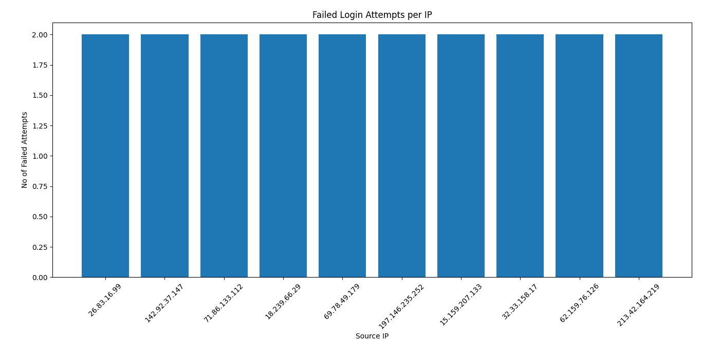
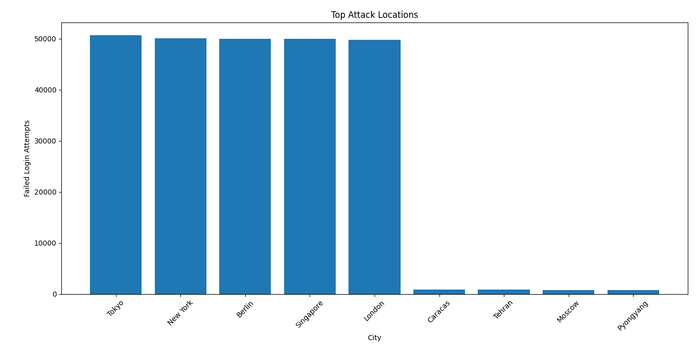
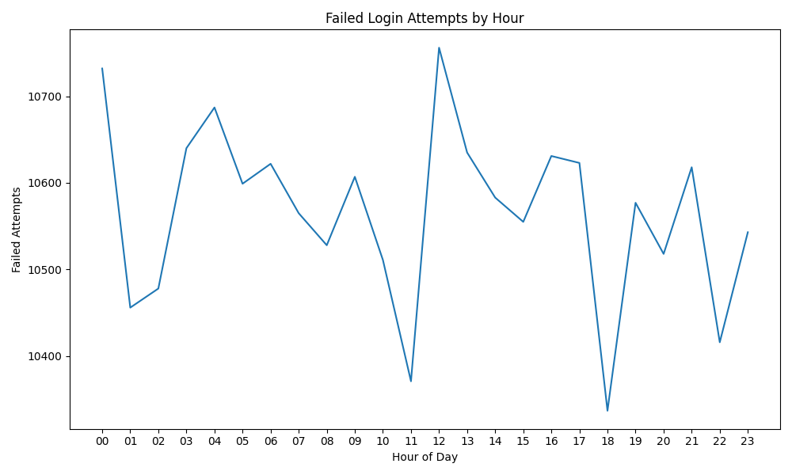

# 🔐 Security Log Analyzer
A web-based security tool that analyzes authentication logs to detect failed login attempts and suspicious activity.

Built with Python and Streamlit, this project helps visualize login patterns and supports basic threat detection workflows.

## 🚀 Live Demo
👉 https://security-log-analyzer-hezir3nehnmgk4gfgwxfnv.streamlit.app/

## Example Visualizations

### Top Attacking IPs


### Attack Locations


### Attack Timeline


## Key Features

* Detect brute-force login attacks from authentication logs
* Identify top attacking IP addresses
* Analyze attack origins by city/location
* Detect attack spikes across different hours of the day
* Visualize attack patterns using graphs
* Generate automated security reports
* Export attacker data for further investigation

## Technologies Used

* Python
* CSV log parsing
* Data visualization with Matplotlib
* Security event analysis
* Command-line automation

## 📊 How It Works
The application processes authentication log data and identifies failed login attempts. It then generates visual insights to help detect unusual patterns and potential security threats.

## 🎯 Use Case
This tool can be used by security analysts or small organizations to monitor login activity and detect suspicious behavior early.

## Usage
## ▶️ Run Locally
```bash
pip install -r requirements.txt
streamlit run analyzer.py

Run log analysis:

python analyzer.py analyze auth_log.csv

Start real-time monitoring:

python analyzer.py monitor auth_log.csv

Launch the dashboard:

python analyzer.py dashboard
